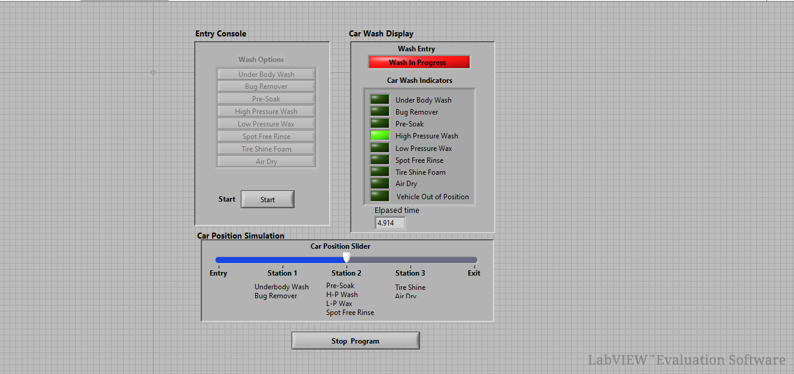

# Car Wash Automation Using LabVIEW

## 🔹 Project Overview

This project implements an **Automated Car Wash Process Simulation in NI LabVIEW** with a graphical and interactive user interface. The program mimics real commercial car wash workflow using multiple stations and safety checks, demonstrating **sequential control logic** similar to industrial automation systems.

---

## 📸 Screenshot

> The above image shows the front panel layout including Wash Options, Status Indicators, Elapsed Time display, and Car Position Slider.

---

## 🖥 User Interface Description

### 1️⃣ Entry Console

**Wash Options Buttons**
- Under Body Wash  
- Bug Remover  
- Pre-Soak  
- High Pressure Wash  
- Low Pressure Wax  
- Spot Free Rinse  
- Tire Shine Foam  
- Air Dry  

**Start Button:** Begins the wash sequence after option selection.

---

### 2️⃣ Car Wash Display

- Boolean indicators for each process stage  
- **Vehicle Out of Position Lamp** for safety monitoring  
- **Elapsed Time Indicator** showing real-time progress  
- Status banner displaying **“Wash In Progress / Completed.”**

---

### 3️⃣ Car Position Simulation

**Car Position Slider Movement**
- Entry → Station 1 → Station 2 → Station 3 → Exit  

**Station Mapping**
- **Station 1:** Underbody Wash, Bug Remover  
- **Station 2:** Pre-Soak, H-P Wash, L-P Wax, Spot Free Rinse  
- **Station 3:** Tire Shine, Air Dry

---

## 🧠 Implementation & Logic

Designed using **State Machine Architecture** in the LabVIEW block diagram.

**Shift Registers retain:**
- selected wash options  
- current car position  
- timer values  

### Operational Flow

1. **Idle State** – Wait for operator to select wash options.  
2. **Option Validation** – Sequence will not start if car is out of position.  
3. **Start Sequence** – Car moves to Station 1 → corresponding indicators ON.  
4. **Process Stations Execution** – Each station activated based on slider and user selection.  
5. **Timer Handling** – Elapsed time updated continuously.  
6. **Completion & Reset** – System ready for next vehicle.

### Concepts Used

- While Loop  
- Case Structure  
- Arrays & Indexing  
- Boolean Logic  
- Timing Functions  
- Interlock / Safety Condition

---

## 🚀 How to Run

1. Open `CarWash.vi` in NI LabVIEW.  
2. Select required **Wash Options**.  
3. Ensure car slider is at **Entry**.  
4. Press **Start**.  
5. Move slider to simulate station movement.  
6. Observe indicators and elapsed time.  
7. Press **Stop Program** to end.

---

## 📂 Files Included

- `CarWash.vi` – Main VI  
- `Controls.ctl` – Custom controls for buttons & slider  
- `SubVIs` – station controller, timer, initialization

---

## 🛠 Requirements

- NI LabVIEW 2020 or later  
- Windows OS  
- NI Runtime (optional for EXE build)

---

## 📚 Learning Outcomes

- Industrial style sequential automation  
- LabVIEW UI design  
- Event / Polling mechanism  
- State machine development  
- Safety interlock concept  
- Time based process control

---

## 🔮 Future Enhancements

- Payment module for wash types  
- Station timeout & auto stop  
- Data logging to CSV  
- Hardware integration via Arduino / CAN  
- Touch screen themed UI

---

## 📢 Conclusion

The project demonstrates how NI LabVIEW can be used to develop **process-oriented automation applications** like automated car wash machines with clear operator interface and industrial logic.

---

**Developed by:**  
Jenna – BE ECE | LabVIEW & Embedded Enthusiast
